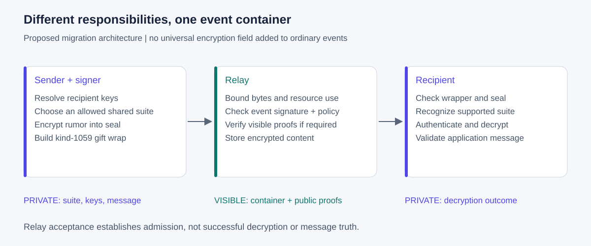
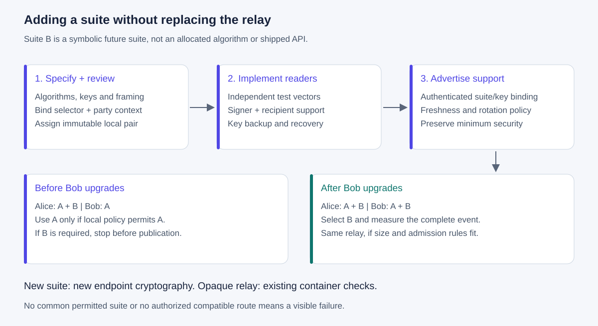
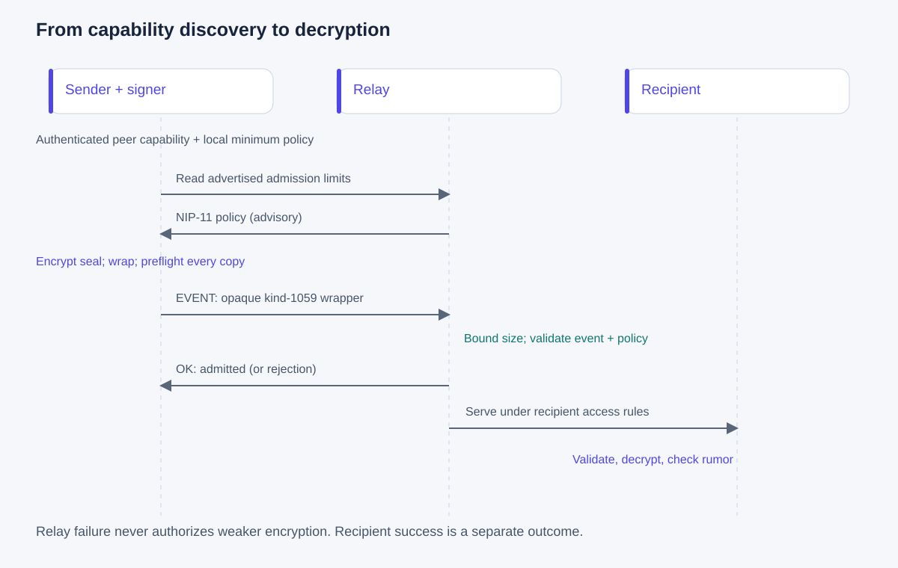

# 07 - Adding encryption suites and routing through capable relays

`proposal` `optional` `not implemented`

This companion to [draft 05](05-relay-crypto-agility.md) explains how encryption can evolve without requiring relays to understand private content. The examples below are design examples, not APIs already available in the extension or SDK. Existing draft-03 bytes and draft-04 calls remain unchanged.

## The model

A relay is content-agnostic within a declared admission policy. It validates the event container, public authentication and resource/access rules. A client understands the application and a signer performs encryption. A recipient authenticates and decrypts the private payload. These responsibilities must remain separate.



| Question | Authority | What it does not establish |
|---|---|---|
| Can this account encrypt/decrypt suite S? | Signer implementation plus account authorization/key availability | Recipient support |
| Can the recipient decrypt suite S with key K? | Authenticated recipient capability/key binding | Relay acceptance or current device availability |
| Will this relay transport the event? | Relay admission policy and actual `OK` response | Successful decryption or delivery to a person |
| Can this relay verify proof P? | Installed public verifier plus trusted key state | Confidentiality of hidden content |
| Is the decrypted application message valid? | Recipient client | Truth of the message's claims |

"Agnostic" does not mean accepting malformed events or treating every kind identically. NIP-01 kind-dependent replacement/ephemeral behavior, deletion handling and access restrictions still matter. A new encrypted application can reuse the existing container; changing event IDs, public-key types or outer signatures requires a separately specified event-authentication migration.

## How a new encryption methodology becomes a suite

A suite is an immutable definition of algorithms and parameters, not an algorithm name supplied by the sender. Switching the KEM, combiner, AEAD, padding, transcript or key format changes the suite. A fundamentally different framing/session protocol may require a new envelope version rather than another suite in version 1.

1. **Specify the construction.** Define threat model, KEM or key-agreement mechanism, parameter sets, KDF/combiner inputs, domain separators, nonce rules, authenticated fields, key identifiers, payload order, padding and resource limits. State whether the design is hybrid, and what forward secrecy or compromise recovery it actually provides.
2. **Define byte-level compatibility.** Specify key sizes and encoding, canonical serialization, failure behavior and exactly which existing fields remain unchanged. Provide positive and negative vectors. Bound lengths before allocation or decapsulation. An unknown selector is unsupported, never a request to download code or guess another algorithm.
3. **Review and assign locally.** Obtain independent cryptographic and interoperability review before assigning a pair in the local envelope registry. Record the complete specification revision with the assignment. No pair may later acquire new semantics. This repository cannot allocate NIP-44 versions or official NIP numbers.
4. **Ship readers before default writers.** Implement signer decryption and key import/recovery, then explicit encryption selection. Verify with a second independent implementation, including malformed messages and stale or conflicting keys. Shared-SDK round-trips alone are insufficient.
5. **Advertise endpoint support.** Publish an authenticated binding of recipient identity, exact suite, required public key material and capability validity/rotation information. Implement exact-suite signer discovery after the existing account-consent boundary. Do not infer support for new suites from today's broad `schemes: ["nip44", "pq"]` marker.
6. **Enable policy-controlled sending.** Select only among the intersection of sender support, recipient support and local security policy. Retain the selected key binding while preparing each copy. Recheck expiration/key changes before publication. Measure the fully wrapped event against the selected inbox relays.
7. **Retire carefully.** Stop new writes under a retired suite without silently substituting another suite. Keep a policy for decrypting retained history, old key backups and authenticated key rotation. A higher suite number does not mean stronger security.

### Registry example

| Envelope version | Suite | Status | Meaning |
|---|---|---|---|
| `0x01` | `0x01` | Existing local format | Draft-03 ML-KEM-1024 + classical conversation key + specified KDF/AEAD |
| `0x01` | `S_NEW` | Symbolic, unallocated | A reviewed future suite preserving compatible framing |
| `V_NEW` | `S_NEW` | Symbolic, unallocated | A future format needing different framing or protocol state |

`S_NEW` and `V_NEW` are placeholders, not values a client can emit. This document deliberately allocates no new algorithm. For example, proposing a different KEM requires defining and reviewing its key encoding, combiner and ciphertext sizes; it is not sufficient to replace the first byte of an existing message.

The existing pair remains two binary bytes: one version and one suite. Their meaning is authenticated by the envelope construction. New suites must also authenticate their selectors and party/key context. Advertisements can use readable names and full specification references; the repeated payload uses the compact registered pair.

## Worked example: Alice upgrades before Bob

Alice can use the existing suite A and a reviewed future suite B. Bob advertises only A. Alice's policy still allows A, so they use A. This is an explicit supported choice before encryption, not a retry after a B decryption failure. If Alice's policy requires B, sending stops with a capability mismatch until Bob upgrades.

Later Bob upgrades, publishes authenticated B capability with its required key material, and Alice validates that binding. They can now choose B through the same relay. The relay receives the same kind-1059 container; it does not inspect the encrypted selector inside the seal. If B's larger ciphertext exceeds the relay's limit, choose another suitable relay only from Bob's authorized inbox list, or report no usable route. Never lower the crypto policy to satisfy the relay.



Capability suppression is a downgrade risk. An absent or stale advertisement is not proof that a previously authenticated capability has been withdrawn. Persist minimum security policy and use authenticated lifecycle rules. Draft 02 defines the current key attestation only; a multi-suite capability record, its expiry and its rotation protocol still need a separate complete wire specification. No new tags or event kinds are silently added to draft 02 by this example.

### Illustrative client orchestration

The following is pseudocode, not a new `window.nostr` API. `resolveAuthenticatedCapabilities` and `selectAllowedSuite` represent client policy operations whose multi-suite wire protocol is still to be specified.

```text
sender = obtainAuthorizedSignerCapabilities()
peer = resolveAuthenticatedCapabilities(recipient)
suite = selectAllowedSuite(sender, peer, localMinimumPolicy)
if suite is absent: stop("No mutually supported permitted suite")

copies = recipientsIncludingRequiredSenderBackup()
for each destination in copies:
    validateCapabilityAndKeyBinding(destination, suite)
    rumor = buildApplicationMessage(destination)
    seal = signer.encryptAndSeal(rumor, suite, destination.keyBinding)
    wrap = ordinaryGiftWrap(seal, destination.nostrPubkey)
    routes = compatibleRoutes(destination.authorizedInboxRelays, wrap)
    if routes is empty: stop before publishing any prepared copy
    stage(wrap, routes)

publishPreparedCopies()
recordEveryRelayResult()
```

This example chooses one common suite for the room. A future design allowing per-recipient suites needs explicit policy and UI semantics; it must not weaken any copy, including sender backups. Preflight all copies before publication. Network failure can still cause partial publication; there is no atomic multi-relay transaction. Report per-copy outcomes and retry the same prepared event to avoid generating duplicate messages.

## Relay policy: capabilities plus admission parameters

Use ordinary NIP-11 limitations for message bytes, content characters, tag counts and connection requirements. Draft 05's proposed `org.nostr-wot.crypto` namespace describes public-verification capability. This document adds an optional proposed `admission` object in that namespace, with these precise meanings:

| Field | Meaning |
|---|---|
| `allowed_kinds` | Optional array of integer kinds permitted by this advertised rule. Omitted means no kind allowlist in this rule, not a promise of acceptance. Empty means no writes admitted. |
| `required_public_proof_kinds` | Optional array of kinds for which the advertised public proof is required. Omitted/empty adds no per-kind requirement; pinned-identity minimums still apply. |
| `opaque_content` | The relay need not interpret application content. It never means bypassing public proof verification when a verifier policy applies. |
| `event_auth.profiles` | Exact installed public proof profiles. A relay must not list a verifier it does not execute. |
| `event_auth.policy` | `verify-present` validates every present supported proof and rejects unknown/invalid proofs. `require` also requires a proof on every admitted write; an inbox relay must not use it for ordinary ephemeral gift wraps. |

Arrays contain distinct integers in the valid NIP-01 kind range; duplicates, wrong types and invalid combinations make the proposal's policy description unusable. `required_public_proof_kinds` requires an `event_auth` verifier and must be a subset of `allowed_kinds` when an allowlist exists. `require` covers all admitted kinds regardless of the narrower list. Existing per-author pins can impose stricter requirements. Advertisements never reset them.

These fields are a proposed interoperable policy vocabulary, not a complete list of abuse controls or a guarantee of acceptance. Operators retain quotas, retention and other documented rules. Do not publish secrets, internal reputation scores or executable validation scripts. Configure local verifier implementations by allowlisted profile identifier; do not dynamically execute code named by events or remote metadata.

### Example: inbox relay with optional public-note validation

```json
{
  "supported_nips": [1, 11, 17, 42],
  "limitation": {
    "max_message_length": 32768,
    "max_content_length": 24000,
    "max_event_tags": 64,
    "restricted_writes": true
  },
  "org.nostr-wot.crypto": {
    "version": 1,
    "opaque_content": true,
    "admission": {
      "allowed_kinds": [1, 1059, 10050, 10203],
      "required_public_proof_kinds": [1]
    },
    "event_auth": {
      "profiles": ["nostr-wot/hybrid-event/1"],
      "policy": "verify-present",
      "max_proofs_per_event": 1
    }
  }
}
```

This hypothetical upgraded relay transports kind-1059 messages with ordinary ephemeral signatures, stores key/inbox discovery, and requires a draft-06 proof on public kind-1 notes. It still validates any present public proof on admitted kinds. It does not require the hidden sender's proof on the public gift wrap. Identity pins and discovery bootstrap/rotation must follow the audit's constraints; allowing classical discovery does not authorize overwriting a pinned key.

The NIP list is illustrative and assumes the stated implementations exist. Serving recipient-only gift wraps requires the corresponding NIP-17/NIP-42 access behavior. A pure inbox operator can omit `event_auth` and the per-kind proof requirement, and allow only its inbox/discovery kinds. A relay restricted to PQ-authenticated public events can use `require`, but is then unsuitable for ordinary NIP-17 wrapper publication.

### Routing examples

| Prepared event | Relay policy | Client result |
|---|---|---|
| Existing hybrid DM, 5295-byte audit fixture | Admits 1059; 32768-byte message limit; no outer PQ-proof requirement | Candidate route, subject to all other rules and actual acknowledgment |
| Future suite B DM, illustrative 20000-byte frame | Same policy | Candidate route without teaching relay suite B |
| Future suite B DM, illustrative 40000-byte frame | Same policy | Too large; another authorized inbox route or visible failure |
| Ordinary unsigned/invalid container | Any NIP-01 relay | Reject before content processing |
| Public note without PQ proof | Above per-kind rule for kind 1 | Reject with proof-required policy result |
| Valid-looking public proof with unknown profile | Advertising verifier in `verify-present` mode | Reject; never reinterpret as classical |
| Relay requires PQ proof on every admitted event | Ordinary kind-1059 wrapper | Incompatible route; do not expose sender identity to satisfy it |

The 20000/40000-byte examples are arbitrary future payload sizes, not measurements of a new algorithm. All standard limits and access rules apply together; satisfying the frame limit alone is insufficient.

## End-to-end flow and rejection boundaries



1. The sender resolves authenticated recipient capabilities and authorized inbox routes, then checks local policy.
2. The signer produces the selected encrypted seal and the client builds a standard outer gift wrap. The sender checks all prepared copies against advertised route constraints before sending.
3. The relay bounds bytes and parsing work, validates NIP-01, checks access/kind rules and applies any visible-proof policy. It stores/serves admitted opaque content under its retention rules.
4. The relay returns an `OK` acknowledgment for the outer event. Rejection cannot trigger automatic weaker encryption. Missing or stale discovery may lead to a policy-preserving attempt, but strict verifier requirements need an explicit suitable capability.
5. The recipient authenticates the outer event and seal, decrypts according to the authenticated suite context, checks rumor/author consistency and applies application validation. A relay acceptance is not a recipient decryption receipt.

Relays cannot validate hidden message kinds, private encryption strength or the meaning of private text. They can validate visible event structure, public signatures/proofs and configured admission conditions. For public structured content, an operator may install a bounded application validator, but that is separate from transporting encrypted payloads and must be advertised as its own specified capability before clients rely on it.

## Interoperability checks before rollout

Test absent/unknown discovery, unsupported policy versions, malformed admission arrays, conflicting proof requirements, pinned-identity overrides, old signers ignoring options, mismatched recipient keys, selector tampering, suite retirement, oversized wrapped payloads and partial multi-relay delivery. Test that a relay transports suite B without having B's decryptor, and that it never claims to have validated that hidden suite. Repeat the cryptographic vectors in independent implementations. The SVGs explain the intended design; they are not evidence of deployed interoperability.

## References

[NIP-11 relay metadata](https://github.com/nostr-protocol/nips/blob/master/11.md), [NIP-17 inbox routing](https://github.com/nostr-protocol/nips/blob/master/17.md), [draft 03](03-pq-nip44-envelope.md), [draft 04](04-nip07-encryption-capability.md), [draft 05](05-relay-crypto-agility.md), [draft 06](06-hybrid-event-authentication.md), and the [complexity and sizing audit](AUDIT.md). Primary protocol references checked 2026-09-12.
